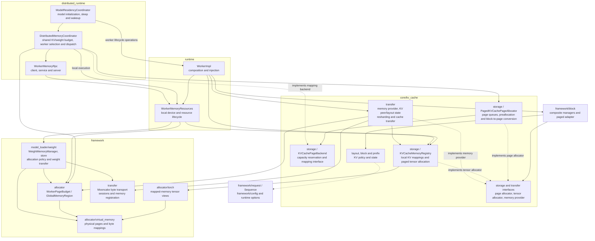

## Start with these files

Follow this order on your first pass. Read the named functions and their
immediate callees before exploring platform-specific implementations.

| Order | Entry point | Question it answers |
| --- | --- | --- |
| 1 | [`xllm/xllm.cpp`](https://github.com/xLLM-AI/xllm/blob/main/xllm/xllm.cpp): `main()`, `run()` | How are configuration, the master, and the HTTP service connected? |
| 2 | [`chat_service_impl.cpp`](https://github.com/xLLM-AI/xllm/blob/main/xllm/api_service/chat_service_impl.cpp): `ChatServiceImpl::process_async_impl()` | How do chat messages become an internal request with an output callback? |
| 3 | [`llm_master.cpp`](https://github.com/xLLM-AI/xllm/blob/main/xllm/core/distributed_runtime/llm_master.cpp): `LLMMaster::handle_request()`, `run()` | How does a request enter the scheduler, and what drives the scheduling loop? |
| 4 | [`continuous_scheduler.cpp`](https://github.com/xLLM-AI/xllm/blob/main/xllm/core/scheduler/continuous_scheduler.cpp): `ContinuousSchedulerBase::step()` | How is one batch scheduled, executed, and processed? |
| 5 | [`llm_engine.cpp`](https://github.com/xLLM-AI/xllm/blob/main/xllm/core/distributed_runtime/llm_engine.cpp): `LLMEngine::step()` | How does a batch reach the workers, and how are their results collected? |
| 6 | [`llm_worker_impl.cpp`](https://github.com/xLLM-AI/xllm/blob/main/xllm/core/runtime/llm_worker_impl.cpp): `LLMWorkerImpl::step_internal()` | Where do model execution, logits, and token sampling happen? |

For the first read, follow the path without speculative decoding, PD
disaggregation, or scheduling overlap. These features add branches to the
same basic flow; you do not need to understand them to locate the main path.

## Concepts used in the code

| Concept | Meaning in this guide | Source entry |
| --- | --- | --- |
| Token, prefill, decode | A tokenizer converts text into token IDs. Prefill processes prompt tokens; decode extends the output using previously computed state. Chunked prefill splits a prompt across scheduling steps. | [`tokenizer/`](https://github.com/xLLM-AI/xllm/tree/main/xllm/core/framework/tokenizer), [`scheduler_policy.cpp`](https://github.com/xLLM-AI/xllm/blob/main/xllm/core/scheduler/scheduler_policy.cpp) |
| `Request` | One inference request, including generation settings, output callbacks, and one or more sequences. | [`request.h`](https://github.com/xLLM-AI/xllm/blob/main/xllm/core/framework/request/request.h), [`request_state.h`](https://github.com/xLLM-AI/xllm/blob/main/xllm/core/framework/request/request_state.h) |
| `Sequence` | One evolving token sequence, with its generation progress, stopping state, and cache state. Multiple candidates can belong to one request. | [`sequence.h`](https://github.com/xLLM-AI/xllm/blob/main/xllm/core/framework/request/sequence.h) |
| `Batch`, `BatchGroup` | A `Batch` contains work selected for one execution step. A `BatchGroup` holds the batches for the data-parallel (DP) ranks in that step. | [`batch.h`](https://github.com/xLLM-AI/xllm/blob/main/xllm/core/framework/batch/batch.h), [`batch_group.h`](https://github.com/xLLM-AI/xllm/blob/main/xllm/core/framework/batch/batch_group.h) |
| Rank and parallelism | A rank identifies a participant in parallel execution. DP distributes request work across groups; tensor parallelism (TP) splits model tensor computation across ranks; expert parallelism (EP) distributes mixture-of-experts model experts. | [`parallel_state/`](https://github.com/xLLM-AI/xllm/tree/main/xllm/core/framework/parallel_state) |
| Continuous batching | The scheduler selects work again on each step, allowing new requests to join while completed requests leave. A batch is not fixed for the full lifetime of its requests. | [`continuous_scheduler.h`](https://github.com/xLLM-AI/xllm/blob/main/xllm/core/scheduler/continuous_scheduler.h) |
| KV cache, block, prefix cache | The KV cache stores attention state for reuse. Block managers allocate and reclaim cache capacity; prefix caching allows compatible requests to reuse cached prompt prefixes. | [`kv_cache/`](https://github.com/xLLM-AI/xllm/tree/main/xllm/core/kv_cache), [`block/`](https://github.com/xLLM-AI/xllm/tree/main/xllm/core/framework/block), [`prefix_cache/`](https://github.com/xLLM-AI/xllm/tree/main/xllm/core/kv_cache/prefix) |
| Logits and sampling | Logits are the model's scores for vocabulary tokens. Sampling applies generation settings to choose the next token from those scores. | [`sampling/`](https://github.com/xLLM-AI/xllm/tree/main/xllm/core/framework/sampling) |
| Master, engine, worker, executor | The master connects request handling and scheduling; the engine coordinates batch execution across workers; a worker manages device-side execution; its executor selects how the model runs. | [`distributed_runtime/`](https://github.com/xLLM-AI/xllm/tree/main/xllm/core/distributed_runtime), [`runtime/`](https://github.com/xLLM-AI/xllm/tree/main/xllm/core/runtime) |

## Repository map

This is a navigation map, not an exhaustive file listing. The C++ executable
entry is **`xllm/xllm.cpp`**, inside the source directory.

```text
.
├── xllm/
│   ├── xllm.cpp                           # C++ executable entry
│   ├── launch_server.py                   # Python launcher for xllm serve
│   ├── server/                            # HTTP server lifecycle and route registration
│   ├── api_service/                       # Request parsing, validation, and responses
│   ├── core/
│   │   ├── common/                        # Shared types, options, metrics, and helpers
│   │   ├── distributed_runtime/           # Masters, engines, worker RPC and coordination
│   │   ├── scheduler/                     # Queues, scheduling policies, output processing
│   │   ├── framework/                     # Inference data structures and shared mechanisms
│   │   │   ├── config/                    # Configuration categories and CLI options
│   │   │   ├── request/                   # Request, sequence, and stopping state
│   │   │   ├── batch/                     # Batches and model input builders
│   │   │   ├── block/                     # Composite cache and runtime allocation adapters
│   │   │   ├── kv_cache/                  # Model-aware linear-state restore adapter
│   │   │   ├── model/                     # Model interfaces and input/output types
│   │   │   ├── model_loader/              # Model configuration and checkpoint loading
│   │   │   │   └── weight/                # Weight resources, allocation policy and transfer
│   │   │   ├── tokenizer/                 # Text and token conversion
│   │   │   ├── chat_template/             # Chat messages to model prompts
│   │   │   ├── sampling/                  # Token sampling and constrained decoding
│   │   │   ├── parallel_state/            # Parallel groups and communication state
│   │   │   ├── eplb/                      # Expert parallel load balancing
│   │   │   ├── transfer/                  # Shared byte transport, sessions and registration
│   │   │   └── allocator/                 # Generic memory facilities and page budget accounting
│   │   │       ├── virtual_memory/        # Generic physical pages and virtual mappings
│   │   │       └── torch/                 # Tensor views over mapped byte regions
│   │   ├── kv_cache/                      # Cache domain: layout, storage, blocks, prefixes, transfer
│   │   ├── runtime/                       # Workers, local resources and model executors
│   │   ├── layers/                        # C++ neural-network layers
│   │   ├── kernels/                       # Device operator implementations and wrappers
│   │   ├── platform/                      # Devices, streams, memory, and communication APIs
│   │   └── util/                          # Supporting utilities
│   ├── models/                            # C++ model registration and implementations
│   │   ├── llm/                           # Language models and Python model bridge
│   │   ├── vlm/                           # Vision-language models
│   │   ├── dit/                           # Diffusion models
│   │   └── rec/                           # Generative recommendation models
│   ├── python/                            # Python model execution
│   │   ├── models/                        # Python model definitions
│   │   ├── model_executor/                # Execution coordination and eager/graph runners
│   │   ├── attention/                     # Attention backends and metadata
│   │   ├── model_loader/                  # Weight loading and sharding
│   │   ├── layers/                        # Python neural-network layers
│   │   ├── kernels_cuda/                  # CUDA operators
│   │   ├── kernels_npu/                   # NPU operators, including TileLang/Triton sources
│   │   └── distributed/                   # Model-side collectives
│   ├── processors/                        # Multimodal input preprocessing
│   ├── parser/                            # Reasoning-output parsers
│   ├── function_call/                     # Tool-call parsers
│   ├── proto/                             # Service and internal RPC schemas
│   ├── pybind/                            # Python-facing inference API and C++ bindings
│   ├── c_api/                             # C integration API
│   ├── cc_api/                            # C++ integration API
│   ├── compiler/                          # Kernel compilation and AOT build tooling
│   └── auto_config/                       # Model/hardware-based launch configuration
├── examples/                              # Offline inference examples
├── tests/                                 # C++ and Python tests, including device tests
├── scripts/                               # Build, test, launch, and development helpers
├── tools/                                 # Conversion, tensor comparison, and profiling tools
├── third_party/                           # External dependencies and operator libraries
├── docs/                                  # Bilingual documentation site
├── CMakeLists.txt                         # C++ build configuration
└── setup.py                               # Python packaging and build entry
```

## KV cache and virtual memory boundaries

The memory facilities serve both KV cache and weights. Resource-specific
mapping and allocation policy stay with each resource. Runtime owns local
resources; distributed coordination manages shared budgets, worker operations,
and model sleep/wakeup. In the diagram, a solid arrow means "uses or owns";
a dashed arrow marks interface implementation or a coupling that remains to
be separated.



`framework/allocator/virtual_memory` provides `PhysicalPage`, `PhysicalPagePool`,
`MappedMemoryRegion` and `SharedPageMapping`. A mapped region manages bytes,
physical pages and virtual addresses. Tensor shape, dtype and view creation
live in `framework/allocator/torch`; the returned tensor view does not own the
region. Generic memory code has no KV layout, weight policy or model lifecycle
responsibilities. `GlobalMemoryRegion` is a shared mapping facade with lifetime
leases. Transport registration and its retained mapping lease belong to
`framework/transfer`, which has no KV or distributed-runtime target dependency.

`core/kv_cache/storage` owns `KVCacheMemoryRegions` and
`KVCacheMemoryRegistry`, including model-local cache mappings and physical
offset lookup. `PagedKVCacheTensorAllocator` uses an injected registry to
implement `KVCacheTensorAllocator`. In `core/kv_cache/transfer`,
`PagedKVCacheTransferMemoryProvider` uses that registry and an injected
`GlobalMemoryRegion` to implement `KVCacheTransferMemoryProvider`.
`WorkerImpl` supplies these dependencies. Concrete cache backends consume
generic allocation facilities without depending on distributed coordination.

`framework/model_loader/weight` owns `WeightMemoryManager`, `ModelWeightStore`,
`WeightAllocation` and the weight transfer adapter. It manages weight
reservation ownership, contiguous or fragmented mappings, suballocation
and cleanup using a physical-page pool and shared mapping supplied at
construction. Both weight transfer and KV transfer use the shared Mooncake
byte transport. KV manifests, peer state and resharding plans remain in
`core/kv_cache/transfer`, including `MooncakeKVCacheTransferEngine`.

`runtime/WorkerMemoryResources` owns the local KV registry and
`WeightMemoryManager`, managing device initialization, the physical page pool,
and local resource creation and cleanup. Its separate build target does not
depend on the `runtime` aggregate, RPC or distributed-runtime targets.
`distributed_runtime/WorkerMemoryRpcClient`, `WorkerMemoryRpcService` and
`WorkerMemoryRpcServer` handle requests between workers. The service invokes
local resources without calling back into distributed coordination.

`core/kv_cache/storage/PagedKVCachePageAllocator` owns KV page queues,
preallocation and block-to-virtual-page conversion, implementing
`KVCachePageAllocator`. An injected `KVCachePageBackend` supplies capacity
reservation and map/unmap operations; the allocator has no weight policy or
RPC code. Map/unmap receive byte offsets within each layer's K/V region,
computed by the allocator as virtual page ID times page size.
`KVCacheManagerFactory` injects the page allocator interface through
pools and composite managers into `PagedKVCacheBlockManager`, whose block
adapter does not access a distributed singleton.

`DistributedMemoryCoordinator` implements that backend, owns the paged
allocator, accounts for capacity through generic `WorkerPageBudget`, and
selects workers to dispatch local or RPC operations. `ModelResidencyCoordinator`
organizes model initialization, sleep and wakeup. Distributed coordination
atomically reserves the combined KV and weight budget in one transaction
during wakeup. On initial awake startup, weights reserve capacity first;
later KV page allocations debit the same shared budget. Suspension
first freezes KV allocation and recycling and drains preallocation and
in-flight mappings before changing mappings and the weight lifecycle. This
prevents capacity release from racing with background mapping work. KV cache
owns page policy; distributed-runtime owns cross-resource transactions and
execution across workers.

Block value types form `kv_cache_block_types`, used by request and prefix
cache. Cache domain leaves are compiled by `kv_cache_block`; framework
composition and allocation adapters form the `block` aggregate target.
This is an incremental boundary change: cache block policies still operate
on `Sequence`, capacity estimation still reads framework configuration and
runtime options, and model-specific cache policies remain. Those policy and
input boundaries need further slices before `core/kv_cache` can be treated as
a fully independent domain module.

The protobuf schema `proto/mooncake_transfer_engine.proto` remains a
compatibility bridge: it retains the existing service and method names on
one listener. The generic transport serves session RPCs and forwards cache
RPCs to a KV extension service without interpreting their messages. The
schema still contains KV messages, so this boundary removes C++ domain and
target dependencies rather than completing protocol separation.

The canonical options are `enable_virtual_memory` and
`virtual_memory_master_node_addr`. Their former `xtensor` spellings remain
CLI/JSON aliases. Explicit CLI settings override JSON, and canonical names
win when both spellings occur in the same source. Exported config uses the
canonical names. The `_xtensor` registration signature remains a stable
compatibility identifier.

Splitting the local resource, distributed coordinator and RPC C++ classes
does not change the wire schema. `proto/model_memory_dist.proto` retains the
`ModelMemoryDist` service and `GetKVCacheOffsets` method. The current protocol
preserves field numbers, and the heartbeat JSON field is `virtual_memory_info`.
These protocol names differ from the former xtensor version. Upgrade masters,
workers and external heartbeat consumers together; RPC routes from before
and after that rename cannot be mixed.

The most useful distinction is between **state**, **scheduling**, and
**execution**: `framework/` defines requests, batches, caches, and model
interfaces; `scheduler/` decides what runs next; `distributed_runtime/` and
`runtime/` dispatch and execute that work. A model in `models/` or
`python/models/` describes the network computation.

## Follow one chat request

### Startup

[`launch_server.py`](https://github.com/xLLM-AI/xllm/blob/main/xllm/launch_server.py)
handles the `xllm serve` launch command. In the C++ executable,
`main()` initializes configuration, then `run()` creates the master through
[`create_master()`](https://github.com/xLLM-AI/xllm/blob/main/xllm/core/distributed_runtime/master_factory.cpp).
For the `llm` backend, `LLMMaster` sets up the engine, scheduler, tokenizer,
and request factory. `master->run()` starts its loop, and the serving rank
starts `APIService` through
[`server/xllm_server.cpp`](https://github.com/xLLM-AI/xllm/blob/main/xllm/server/xllm_server.cpp).

### Request and response flow

The following is the logical flow for text generation. Queueing, worker
communication, and response callbacks mean it is not one synchronous call
stack. The scheduler repeats the execution step until generation finishes.

```text
POST /v1/chat/completions
  -> HTTP route / APIService / ChatServiceImpl
  -> LLMMaster / LLMRequestFactory
       messages -> chat template -> prompt -> token IDs -> Request
  -> ContinuousSchedulerBase / SchedulerPolicy
       choose sequences and token budgets -> BatchGroup
  -> LLMEngine
       build inputs -> dispatch to worker ranks
  -> LLMWorkerImpl / Executor
       model forward -> logits -> sampling -> token results
  -> update sequences / AsyncResponseProcessor
       token IDs -> text -> RequestOutput
  -> ChatServiceImpl callback -> JSON response or SSE stream
```

1. **Accept and parse the request.** The route is registered in
   `server/xllm_server.cpp`.
   [`api_service.cpp`](https://github.com/xLLM-AI/xllm/blob/main/xllm/api_service/api_service.cpp),
   [`openai_request.cpp`](https://github.com/xLLM-AI/xllm/blob/main/xllm/api_service/openai_request.cpp),
   and [`chat_request_decoder.cpp`](https://github.com/xLLM-AI/xllm/blob/main/xllm/api_service/chat_request_decoder.cpp)
   handle the HTTP body, normalization, validation, and decoding into the
   internal protocol. `ChatServiceImpl` selects the model master and prepares
   messages, generation parameters, and an output callback.

2. **Construct the inference request.** `LLMMaster::handle_request()` hands
   work to its request thread pool.
   [`LLMRequestFactory`](https://github.com/xLLM-AI/xllm/blob/main/xllm/core/framework/request/llm_request_factory.cpp)
   applies the chat template, tokenizes and validates the prompt, and creates
   request/sequence state. The master then calls `scheduler_->add_request()`.

3. **Choose work for the next step.** `ContinuousSchedulerBase` manages the
   request queues and execution loop.
   [`scheduler_policy.cpp`](https://github.com/xLLM-AI/xllm/blob/main/xllm/core/scheduler/scheduler_policy.cpp)
   contains the batch-assembly policies: `PrefillFirstPolicy`,
   `DecodeFirstPolicy`, and `UnifiedPolicy`. They consider token/sequence
   budgets and cache capacity. Read this file when investigating which
   requests run together; policy selection is separate from the loop itself.

4. **Prepare inputs and dispatch.** `LLMEngine::step()` prepares inputs for
   the DP batches and dispatches them through
   [`WorkerClient`](https://github.com/xLLM-AI/xllm/blob/main/xllm/core/runtime/worker_client.h).
   To inspect token positions, sequence lengths, and cache mappings, follow
   [`batch/`](https://github.com/xLLM-AI/xllm/tree/main/xllm/core/framework/batch),
   especially `ForwardInputBuilder`, rather than starting in a model layer.

5. **Run the model and sample.** `LLMWorkerImpl::step_internal()` invokes
   [`Executor`](https://github.com/xLLM-AI/xllm/blob/main/xllm/core/runtime/executor.cpp),
   obtains model outputs and logits, and uses
   [`sampling/`](https://github.com/xLLM-AI/xllm/tree/main/xllm/core/framework/sampling)
   to select output tokens. The executor chooses the C++ or Python execution
   implementation; the next section shows that boundary.

6. **Return output and continue or finish.** Engine results update sequence
   state. The scheduler processes batch output and completion;
   [`AsyncResponseProcessor`](https://github.com/xLLM-AI/xllm/blob/main/xllm/core/scheduler/async_response_processor.cpp)
   produces decoded `RequestOutput` values and invokes callbacks. The chat
   service formats a complete JSON response or Server-Sent Events (SSE).
   Reasoning and tool-call parsers participate when configured. Follow
   [`stopping_checker.h`](https://github.com/xLLM-AI/xllm/blob/main/xllm/core/framework/request/stopping_checker.h)
   for stop conditions, and the scheduler/cache managers for resource release.

## C++ and Python model execution

The HTTP service and scheduling flow above are shared. `--model_impl=python`
selects Python model execution while requests, scheduling, cache management,
worker coordination, and sampling remain in C++.

| Area | C++ model path | Python model path |
| --- | --- | --- |
| Selection | Empty `model_impl` or `--model_impl=native` | `--model_impl=python`, subject to model/platform support |
| Model entry | [`models/model_registry.h`](https://github.com/xLLM-AI/xllm/blob/main/xllm/models/model_registry.h) and [`models/llm/qwen3.h`](https://github.com/xLLM-AI/xllm/blob/main/xllm/models/llm/qwen3.h) as a reading example | [`models/llm/py_causal_lm.cpp`](https://github.com/xLLM-AI/xllm/blob/main/xllm/models/llm/py_causal_lm.cpp), [`python/registry.py`](https://github.com/xLLM-AI/xllm/blob/main/xllm/python/registry.py), and [`python/models/qwen3.py`](https://github.com/xLLM-AI/xllm/blob/main/xllm/python/models/qwen3.py) |
| Execution | [`core/runtime/`](https://github.com/xLLM-AI/xllm/tree/main/xllm/core/runtime): base and device-specific executors | [`py_executor_impl.cpp`](https://github.com/xLLM-AI/xllm/blob/main/xllm/core/runtime/py_executor_impl.cpp) bridges to [`ModelExecutor`](https://github.com/xLLM-AI/xllm/blob/main/xllm/python/model_executor/executor.py) and its runners |
| Layers and operators | `core/layers/`, `core/kernels/`, `core/platform/` | `python/layers/`, `python/attention/`, `python/kernels_cuda/`, `python/kernels_npu/` |
| Weights | `core/framework/model_loader/`, `core/framework/state_dict/`, and model/layer loaders | The C++ model bridge plus `python/model_loader/` and model-specific loading |

Keep three choices separate when tracing configuration:

- **Serving backend** (`llm`, `vlm`, `dit`, `rec`) chooses the master/engine
  family. Start at `master_factory.cpp`.
- **Model implementation** (`native` or `python`) chooses the model execution
  path. Start at `core/runtime/executor.cpp` and
  [`model_config.cpp`](https://github.com/xLLM-AI/xllm/blob/main/xllm/core/framework/config/model_config.cpp).
- **Hardware and execution mode** determine which device operators and eager
  or graph executors can be used. For Python, inspect `ModelExecutor` and
  [`runners/`](https://github.com/xLLM-AI/xllm/tree/main/xllm/python/model_executor/runners)
  for `python_graph_backend` handling. Supported combinations depend on the
  model and platform; graph mode does not imply every batch uses a graph.

`xllm/pybind/` is the Python-facing inference API, used by examples such as
[`examples/generate.py`](https://github.com/xLLM-AI/xllm/blob/main/examples/generate.py).
`xllm/python/` implements model execution. Calling the Python inference API
does not by itself select a Python model implementation.

For more detail, read the
[C++ Framework + Python Model design](/en/design/cpp_framework_python_model_architecture/),
[Graph Mode design](/en/design/graph_mode_design/), and the
[`xllm/python/` package guide](https://github.com/xLLM-AI/xllm/blob/main/xllm/python/README.md).
