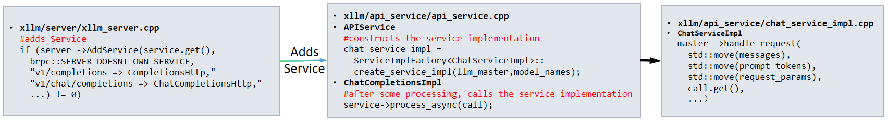
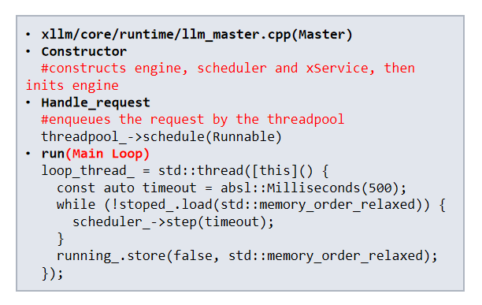
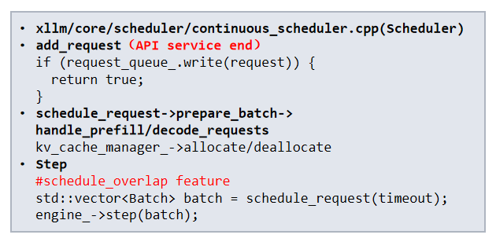
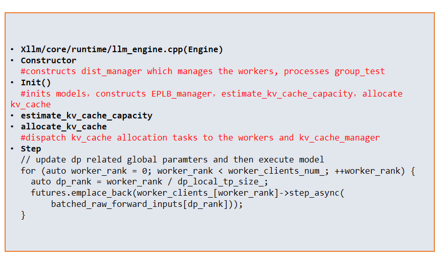
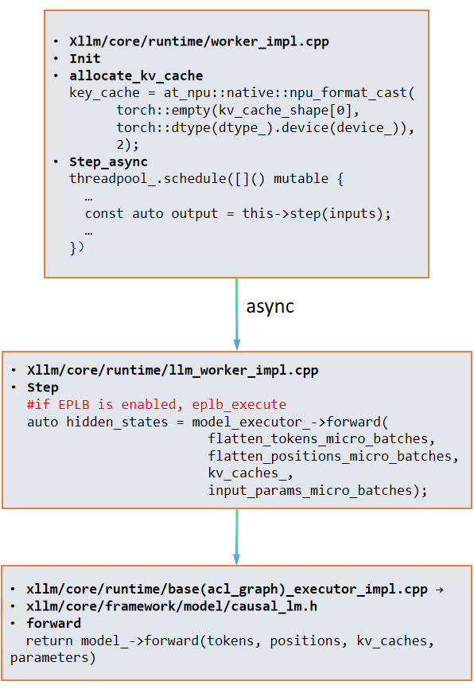
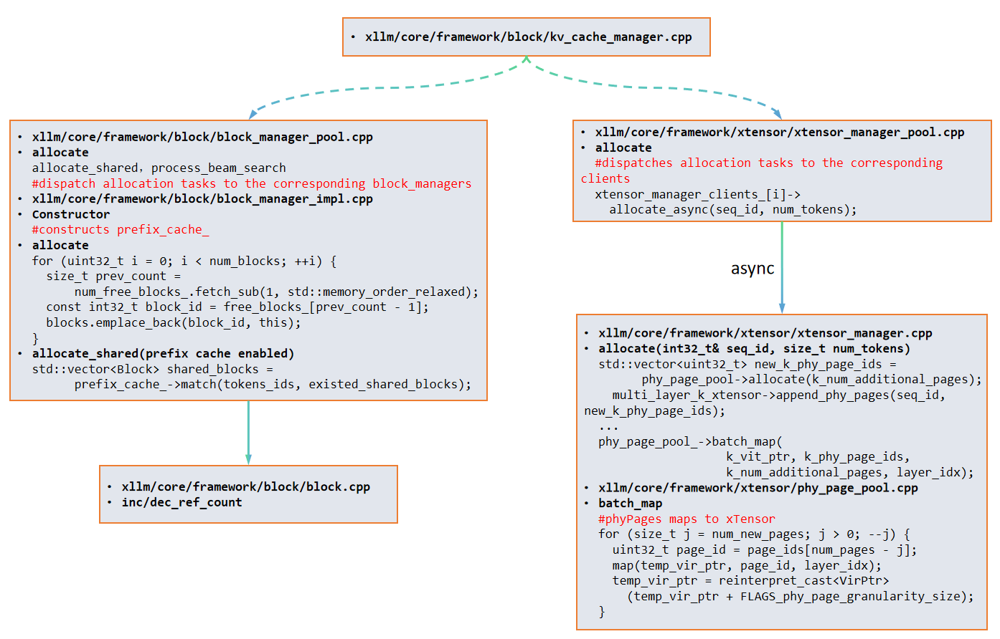
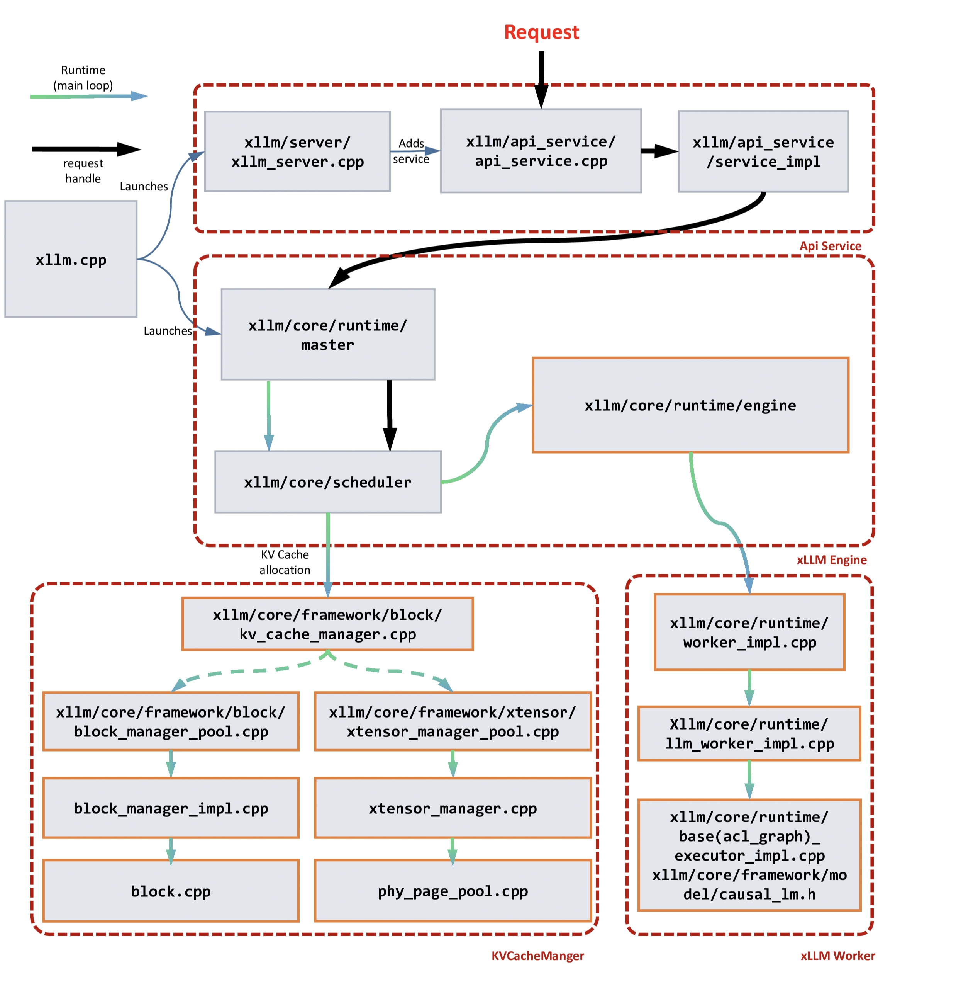

# xLLM核心模块与架构技术说明

本文提供了xLLM推理服务系统中核心模块的技术概述，详细介绍了它们的功能、架构定位和关键职责。

## 核心模块功能概览

以下表格总结了xLLM架构中的主要组件、对应的代码路径及其在推理流水线中的角色。

| 模块名称 | 代码路径 | 核心功能 | 主要职责 |
| :--- | :--- | :--- | :--- |
| **APIService** | `api_service/api_service.cpp` | 外部接口服务 | 接收外部请求（如OpenAI兼容API调用），将其转化为内部请求格式，并转发给Master。 |
| **Master** (LLM Master) | `core/distributed_runtime/llm_master.cpp` | 控制平面与请求调度器 | 接收请求，驱动调度器和引擎的主执行循环。 |
| **Scheduler** (连续调度器) | `core/scheduler/continuous_scheduler.cpp` | 请求调度与批处理 | 实现动态调度策略，准备批量数据进行处理，管理KV Cache的逻辑分配。 |
| **Engine** (LLM引擎) | `core/distributed_runtime/llm_engine.cpp` | 执行层管理器 | 管理分布式Worker，初始化模型，协调推理执行步骤，处理多层流水线优化。 |
| **Worker** (LLM Worker / Worker实现) | `core/runtime/llm_worker_impl.cpp` | 实际计算单元 | 在AI加速器上执行模型的前向计算，并管理本地物理KV Cache。 |
| **KV Cache Manager** | `core/framework/block/` & `core/framework/xtensor/` | 全局KV Cache管理 | 提供KV Cache的统一管理，包括对连续KV Cache分配的可选支持。 |

## 详细模块描述

### 1. APIService

**APIService**模块作为xLLM的外部接口层，是所有客户端请求的初始入口。它负责接收推理请求并暴露**OpenAI兼容API**（例如`/v1/chat/completions`）。

**代码入口**: `api_service/api_service.cpp`

* **服务封装**: 服务实现（`chat_service_impl`）在`api_service/api_service.cpp`中构建，并集成到**brpc服务器**框架中。
* **请求转发**: 当接收到请求时，`ChatCompletionsImpl`调用`ChatServiceImpl`中的`process_async`方法。
* **核心调用**: 在`chat_service_impl.cpp`中，请求最终通过`master_->handle_request`转发给**Master**模块，供后续调度和执行。

  

### 2. Master (LLM Master)

**Master**模块是xLLM推理服务的**控制平面**。它接受来自APIService的用户请求，作为中心协调者，管理整个请求生命周期，包括排队、调度和执行。

**代码入口**: `core/distributed_runtime/llm_master.cpp`

* **组件集成**: Master在其构造函数中初始化核心组件，如**Engine**和**Scheduler**。
* **请求调度**: 进入的请求通过内部**线程池**（`threadpool_`）异步调度执行（`handle_request`）。
* **驱动循环**: Master维持一个主要执行循环（`run`），持续调用调度器的`step`方法，推动推理过程的进行。

  

### 3. Scheduler (连续调度器)

**Scheduler**模块负责管理所有待处理请求，并应用复杂的**动态调度策略**，确定哪些请求可以合并为单个**批处理**以进行并发推理。

**代码入口**: `core/scheduler/continuous_scheduler.cpp`

* **请求入队**: 从API服务接收到的请求被写入到内部请求队列（`request_queue_.write(request)`）。
* **调度逻辑**: `Step`方法执行`schedule_request`逻辑，包括准备批量数据（`prepare_batch`），处理**Prefill**和**Decode**请求，并与**KV Cache Manager**进行缓存分配和回收。
* **执行调用**: 调度完成后，准备好的批量数据传递给**Engine**的`step`方法进行执行。

  

### 4. Engine (LLM引擎)

**Engine**模块作为**执行层管理器**，负责将调度器准备好的批量任务分配给底层的**Worker**计算单元，并管理分布式环境中的执行流程。

**代码入口**: `core/distributed_runtime/llm_engine.cpp`

* **初始化**: 在构造期间，Engine初始化分布式管理器（`dist_manager`）。其`Init()`方法负责模型初始化及全局KV Cache容量的估算与分配。
* **执行协调**: 在每个推理步骤（`Step`）中，Engine更新与**数据并行性（DP）**相关的全局参数，并通过`worker_clients_[worker_rank]->step_async`异步分发批处理任务给每个Worker客户端。

  

### 5. Worker (LLM Worker / Worker实现)

**Worker**模块是xLLM中执行模型计算的基本单元，通常绑定到一个或多个**AI加速器设备**上。

**代码入口**: `core/runtime/llm_worker_impl.cpp`

* **本地资源管理**: Worker负责在初始化阶段分配KV Cache的本地物理内存（`allocate_kv_cache`）。
* **异步计算**: 它通过内部线程池接收来自Engine的异步调用（`step_async`），并调度实际的计算任务。
* **模型前向计算**: 核心的`Step`方法调用`model_executor_->forward`，执行模型的前向计算，接收输入**Tokens**、位置信息以及**KV Cache**作为参数。

  

### 6. KV Cache Manager (Block Manager & xTensor Manager)

**KV Cache Manager**负责KV Cache的统一管理，并在调度模块分配请求时进行内存分配。

**代码入口**: `core/framework/block/` 和 `core/framework/xtensor/`

#### 6.1 Block Manager

**Block Manager**负责KV Cache块的分配与共享，实施**PagedAttention**机制。

* **块分配**: 它管理一个空闲块池，并在`allocate`方法中从该池中获取一个块ID。
* **前缀缓存**: 支持`allocate_shared`方法，通过匹配Token ID哈希（`prefix_cache_->match`）来重用现有的KV块，从而提高内存利用率。

#### 6.2 xTensor Manager

**xTensor Manager**与**PhyPagePool**结合，实现了基于**虚拟内存管理（VMM）API**的逻辑地址与物理内存映射解耦设计。该设计支持**连续KV Cache存储**和**按需物理内存分配**。

* **xTensor Manager**: 在`allocate`方法中，它从`PhyPagePool`请求物理页ID，并将这些物理页附加到多层K/V xTensors，管理逻辑地址到物理页ID的映射。
* **PhyPagePool**: 该组件管理AI加速器上的物理内存页池，执行低级操作，如`batch_map`，将物理页映射到xTensor的虚拟指针，从而实现**“逻辑连续、物理离散”**的存储模型。

  

## 执行流程图

该图形化展示了APIService、Master、Scheduler、Engine和Worker模块之间的交互和数据流，直观地展示了控制平面和数据平面的分离。

  

